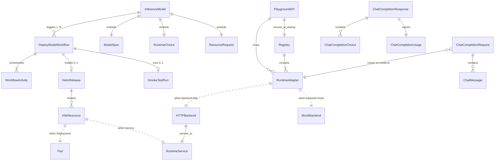
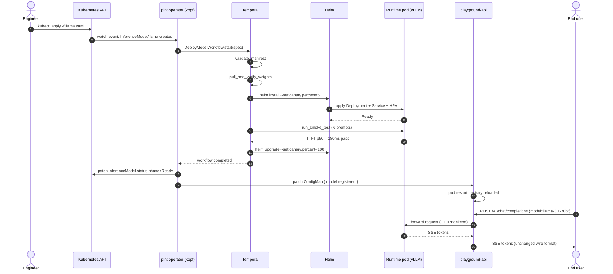
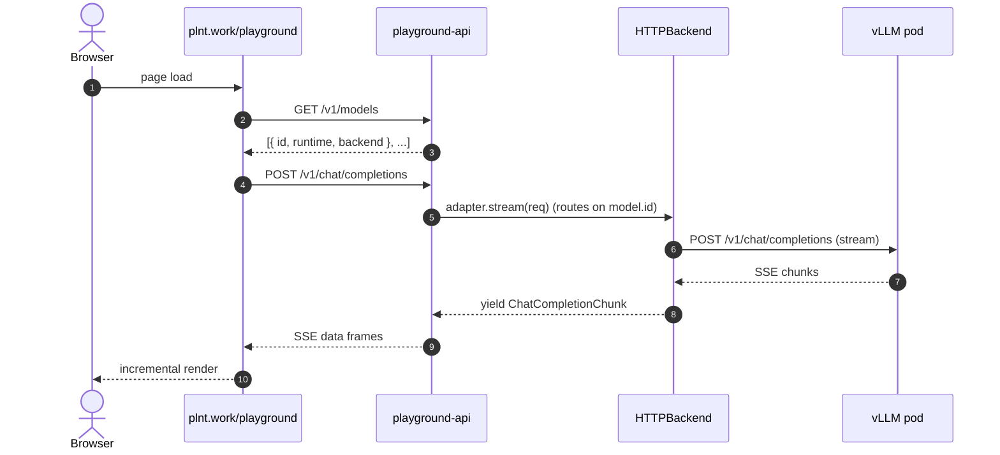
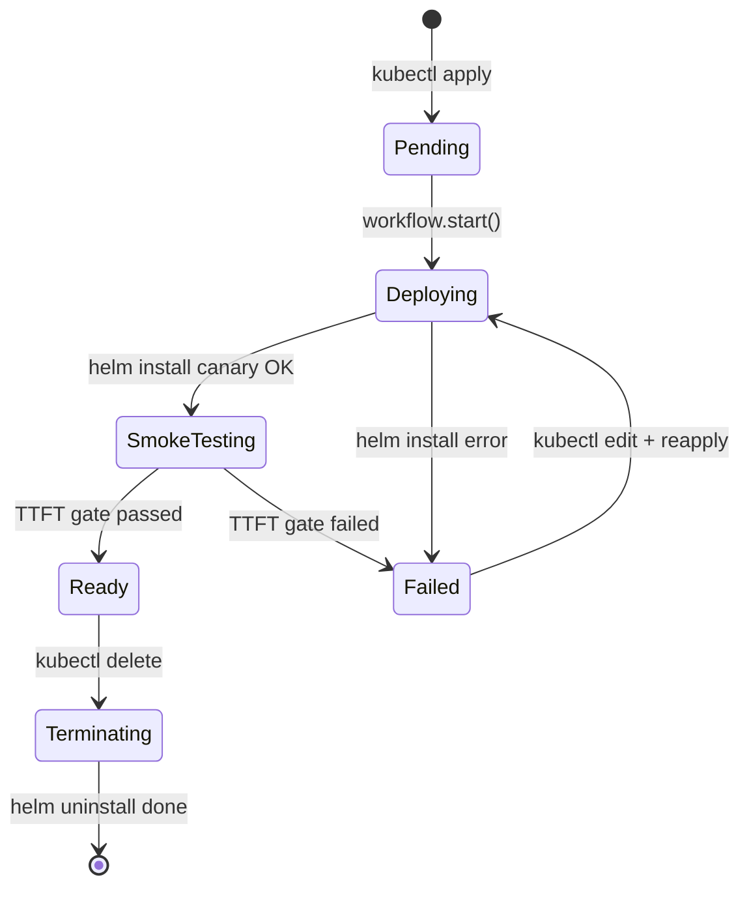

# ERD — plnt data model

There is no relational database in plnt. All state lives in three places:

1. **Kubernetes resources** — the operator's custom `InferenceModel`
   objects + the standard `Deployment`, `Service`, `Ingress`, `ConfigMap`,
   `Certificate` resources the Helm charts render.
2. **Temporal workflow state** — one `DeployModelWorkflow` execution per
   deploy, tracked by Temporal's own event store.
3. **Playground runtime memory** — a `Registry` of `RuntimeAdapter`s
   held in the FastAPI process, mounted from a ConfigMap at startup.

This doc maps the entities, their relationships, and their lifecycles.

---

## Entity map

---

## Entity dictionary

### InferenceModel

**Kind:** Kubernetes CRD, `apiVersion: plnt.work/v1`.
**Owner:** `plnt/operators/crds/inferencemodel.yaml`.
**Purpose:** The declarative unit of "I want this model, served by this
runtime, on this cluster." Applied by `kubectl apply -f` or by
`plnt deploy`.

Sub-fields (`spec.*`):

| Field                  | Type           | Notes                                                |
|------------------------|----------------|------------------------------------------------------|
| `runtime`              | enum           | `vllm` \| `tgi` \| `sglang` \| `trt-llm`             |
| `model.name`           | string         | HF-style, e.g. `meta-llama/Llama-3.1-8B-Instruct`.   |
| `model.storageUri`     | string (opt.)  | Overrides HF pull if weights are pre-staged.         |
| `resources.gpu`        | int            | GPU count per pod (`nvidia.com/gpu` resource req).   |
| `replicas.min/max`     | int/int        | HPA bounds.                                          |
| `canary.percent`       | int, default 5 | Traffic split during smoke-test window.              |

Lifecycle: `Pending -> Deploying -> SmokeTesting -> Ready -> (Terminating)`.
`.status.conditions` mirrors the Temporal workflow's step-level state.

### DeployModelWorkflow

**Kind:** Temporal workflow.
**Owner:** `plnt/workflows/deploy_model.py`.
**Purpose:** The saga that turns `InferenceModel` from "manifest applied"
to "traffic being served."

Steps (each a Temporal activity):

1. `validate_manifest` — values.yaml valid, image pullable, storage URI reachable.
2. `pull_and_verify_weights` — hash-check against registry entry.
3. `helm_install_canary` — deploy chart at N% traffic split (see canary.percent).
4. `run_smoke_test` — N test prompts through the canary. TTFT p50 gate.
5. `promote_or_rollback` — pass -> 100% traffic; fail -> `helm rollback`.

Compensation: any step failure runs `helm rollback` and marks
`InferenceModel.status.phase = Failed`.

### WorkflowActivity

Individual Temporal activity execution. Retry policy per activity
(from `plnt/workflows/activities.py`, mirroring the plnt-cloud
`RetryPolicy(initial_interval, maximum_attempts, backoff_coefficient)`
pattern).

### HelmRelease

Not a plnt-owned type; standard Helm release. Named
`{model-name}-{runtime}` (e.g. `llama-3-8b-vllm`). Tracked in
`helm history` — that's the audit trail for rollback.

### K8sResource -> Pod / RuntimeService

The chart templates render:

- `Deployment` — the runtime pod (vLLM/TGI/etc.) with `nvidia.com/gpu`
  requests.
- `Service` — internal ClusterIP the playground API's HTTPBackend
  proxies to.
- `HorizontalPodAutoscaler` — CPU/memory-based; GPU-utilisation-based
  needs the DCGM exporter which is v0.4.
- `ConfigMap` — runtime args (context length, quant scheme, etc.).

### Registry

**Owner:** `plnt/playground/discovery.py`.
**Purpose:** Playground API's in-memory index of `RuntimeAdapter`s.

Loaded once at pod startup from `PLNT_PLAYGROUND_MODELS`
(inline JSON) or `PLNT_PLAYGROUND_CONFIG` (path to JSON file).

There is **no runtime mutation** — `helm upgrade` with a new list
restarts the pod, which reloads the registry. Model lifecycle is a
Helm/operator concern, not a REST call.

### RuntimeAdapter (protocol)

**Owner:** `plnt/playground/backends.py`.
**Purpose:** Abstract the "how do I talk to a runtime" question so the
playground API can route uniformly.

Implementations:

- **`MockBackend`** — deterministic echo. Zero dependencies. Streams
  word-by-word via SSE for identical UX to real streaming.
- **`HTTPBackend`** — proxies to any OpenAI-compatible upstream on
  HTTP. vLLM (native), TGI (`--openai-api` flag), SGLang (native),
  llama.cpp server (native) all satisfy this contract.

Future:

- **`TritonBackend`** — for TRT-LLM (Triton-native, not HTTP). Lands
  with v0.5.

Every adapter exposes:

- `.model_id: str` — the id shown in `/v1/models`.
- `.runtime: str` — informational tag (used by the site to badge).
- `async def complete(req) -> ChatCompletionResponse` — non-stream.
- `def stream(req) -> AsyncIterator[ChatCompletionChunk]` — SSE.

### ChatCompletionRequest / Response / Chunk

Pydantic models in `plnt/playground/schemas.py`. Match the OpenAI wire
format (see [`api-contract.md`](./api-contract.md) for the full spec).

Wire-format guarantees mechanically enforced by
[`tests/test_site_contract.py`](../tests/test_site_contract.py).

---

## Sequence — happy-path deploy

## Sequence — playground read-path (no operator involved)

---

## State transitions — InferenceModel

---

## Non-entities (things people expect but plnt does not have)

- **User / Session / ChatHistory** — the playground is stateless. No
  user table. No cookies. See PRD section 4 non-goals.
- **APIKey / Token** — no auth surface in v1.
- **ModelArtifact registry table** — Helm chart values + hash pinning
  is the registry surface for now. MLflow client is proposed for v0.4.
- **Metric / Event table** — telemetry is Prometheus + Temporal event
  store, not a plnt-owned DB.
- **Any SQL** — none, on purpose. `git log`, `helm history`,
  `kubectl get events`, `temporal workflow describe` are the audit
  trails.

---

## Related

- API surface: [`api-contract.md`](./api-contract.md)
- Runtime code: [`plnt/playground/backends.py`](../plnt/playground/backends.py)
- Wire schemas: [`plnt/playground/schemas.py`](../plnt/playground/schemas.py)
- CRD yaml: [`plnt/operators/crds/inferencemodel.yaml`](../plnt/operators/crds/inferencemodel.yaml)
- Controller: [`plnt/operators/inferencemodel_controller.py`](../plnt/operators/inferencemodel_controller.py)
- Workflow: [`plnt/workflows/deploy_model.py`](../plnt/workflows/deploy_model.py)
